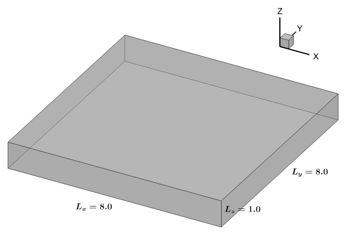
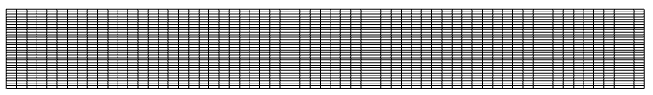
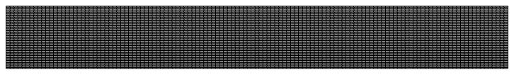

# Rayleigh Benard Convection

## Governing Equations

Incompressible Navier-Stokes equations with body force  :

where,  are the velocities in  and  directions respectively,  is the pressure,  is the density and  is the dynamic viscosity.

## Boussinesq Approximation

This approximation is based on the fact that variation of density induced by the variation of temperature can be everywhere except in the buoyancy term.

Say, the density is expressed as,

where,  and  are the density and the temperature of the fluid at the cold plate respectively.

Substituting  in the momentum equation, we get,

Now, applying the Boussinesq approximation, we neglect the dependence of density in the inertia terms.

Define:

Therefore,

Substituting, we get,

Since, the number of variables is more than the number of equations, we need energy equation to find .

## Non-dimensionalization

Define:

where,  is the distance between the cold plate and the hot plate,  is the temperature of the fluid at the hot plate and  is the kinematic viscosity of the fluid.

## Non-dimensionalized equations

Ignoring  from the non-dimensionalized variables, we get,

where,

## Computational domain

## Computational grid

For testing the code, an initial grid of 64 × 64 × 32 is used before implementing the code on the main grid 128 × 128 × 64.

For discretizing the governing equations, staggered grid system is used where pressure and temperature are stored in the cell center and velocities are stored in cell faces.

    Nx = 64
    Ny = 64
    Nz = 32
    Lx = 8.0
    Ly = 8.0
    Lz = 1.0
    hx = Lx/(Nx-1)
    hy = Ly/(Ny-1)
    hz = Lz/(Nz-1)
    #Generate grid for cell edges
    xe = np.linspace(0,Lx,Nx)
    ye = np.linspace(0,Ly,Ny)
    ze = np.linspace(0,Lz,Nz)
    x, y, z = np.meshgrid(xe, ye, ze, indexing='ij')
    #Generate grid for cell centers
    xc = np.linspace(-hx/2,Lx+hx/2,Nx+1)
    yc = np.linspace(-hy/2,Ly+hy/2,Ny+1)
    zc = np.linspace(-hz/2,Lz+hz/2,Nz+1)

## Initial Conditions

All the variables , , ,  and  are given an initial value of 0 at all the grid points.

    u = np.zeros((Nx,Ny+1,Nz+1))
    v =  np.zeros((Nx+1,Ny,Nz+1))
    w = np.zeros((Nx+1,Ny+1,Nz))
    p = np.zeros((Nx+1,Ny+1,Nz+1))
    T = np.zeros((Nx+1,Ny+1,Nz+1))

where, `Nx`, `Ny`, `Nz` are the number of grid points in x, y and z directions respectively.

## Boundary Conditions

For x and y directions, periodic boundary conditions are applied.

    # Periodic in x
    for j in range(Ny+1):
        for k in range(Nz+1):
            u[0,j,k] = u[Nx-2,j,k]
            u[Nx-1,j,k] = u[1,j,k]
            p[0,j,k] = p[Nx-1,j,k]
            p[Nx,j,k] = p[1,j,k]
            T[0,j,k] = T[Nx-1,j,k]
            T[Nx,j,k] = T[1,j,k]
            if j != Ny:
                v[0,j,k] = v[Nx-1,j,k]
                v[Nx,j,k] = v[1,j,k]
            if k != Nz:
                w[0,j,k] = w[Nx-1,j,k]
                w[Nx,j,k] = w[1,j,k]
    # Periodic in y
    for i in range(Nx+1):
        for k in range(Nz+1):
            v[i,0,k] = v[i,Ny-2,k]
            v[i,Ny-1,k] = v[i,1,k]
            p[i,0,k] = p[i,Ny-1,k]
            p[i,Ny,k] = p[i,1,k]
            T[i,0,k] = T[i,Ny-1,k]
            T[i,Ny,k] = T[i,1,k]
            if i != Nx:
                u[i,0,k] = u[i,Ny-1,k]
                u[i,Ny,k] = u[i,1,k]
            if k != Nz:
                w[i,0,k] = w[i,Ny-1,k]
                w[i,Ny,k] = w[i,1,k]

For z-direction, no-slip boundary condition is applied for velocities and pressure and fixed boundary condition is applied for temperature.

    # For velocities, no-slip at z-min and z-max
    # For temperature, all-fixed at z-min and zmax
    for i in range(Nx+1):
        for j in range(Ny+1):
            w[i,j,0] = 0
            w[i,j,Nz-1] = 0
            p[i,j,0] = p[i,j,1]
            p[i,j,Nz] = p[i,j,Nz-1]
            T[i,j,0] = 2 - T[i,j,1] # T(zmin) = 1
            T[i,j,Nz] = - T[i,j,Nz-1] # T(zmax) = 0
            if i != Nx:
                u[i,j,0] = - u[i,j,1]
                u[i,j,Nz] = - u[i,j,Nz-1]
            if j != Ny:
                v[i,j,0] = - v[i,j,1]
                v[i,j,Nz] = - v[i,j,Nz-1]

## Formulation of the discretized equations

Mixed RK3-CN time-stepping technique is used. Explicit terms are treated using RK3 Williamson scheme and the implicit terms are computed using Crank-Nicholson scheme. Since the grid size is significantly less in the z-direction, the double derivative terms in z-direction are treated as implicit terms.

## Calculation of the explicit terms

For u-momentum and v-momentum equations, explicit terms consist of the advection terms and the diffusion terms.

    Eu = np.zeros((Nx,Ny+1,Nz+1))
    Ev = np.zeros((Nx+1,Ny,Nz+1))
    Ew = np.zeros((Nx+1,Ny+1,Nz))
    ET = np.zeros((Nx+1,Ny+1,Nz+1))
    
    for k in range(1,Nz):
        for j in range(1,Ny):
            for i in range(1,Nx-1):
                # U2x
                uavg2 = 0.5*(u[i+1,j,k]+u[i,j,k])
                uavg1 = 0.5*(u[i,j,k]+u[i-1,j,k])
                
                U2x = ((uavg2)**2-(uavg1)**2)/(xc[i+1]-xc[i])
                
                #UVy
                vavg2 = 0.5*(v[i,j,k]+v[i+1,j,k])
                vavg1 = 0.5*(v[i,j-1,k]+v[i+1,j-1,k])
                uavg2 = 0.5*(u[i,j,k]+u[i,j+1,k])
                uavg1 = 0.5*(u[i,j,k]+u[i,j-1,k])
                
                UVy = (uavg2*vavg2 - uavg1*vavg1)/(ye[j]-ye[j-1])
                
                #UWz
                wavg2 = 0.5*(w[i,j,k]+w[i+1,j,k])
                wavg1 = 0.5*(w[i,j,k-1]+w[i+1,j,k-1])
                uavg2 = 0.5*(u[i,j,k]+u[i,j,k+1])
                uavg1 = 0.5*(u[i,j,k]+u[i,j,k-1])
                
                UWz = (uavg2*wavg2 - uavg1*wavg1)/(ze[k]-ze[k-1])
                
                #Ux2
                Ux2 = ((u[i+1,j,k]-u[i,j,k])/(xe[i+1]-xe[i]) - \
                       (u[i,j,k]-u[i-1,j,k])/(xe[i]-xe[i-1]))/ \
                       (xc[i+1]-xc[i])
                
                #Uy2
                Uy2 = ((u[i,j+1,k]-u[i,j,k])/(yc[j+1]-yc[j]) - \
                       (u[i,j,k]-u[i,j-1,k])/(yc[j]-yc[j-1]))/ \
                       (ye[j]-ye[j-1])
                
                Eu[i,j,k] = U2x + UVy + UWz - (Ux2 + Uy2)
    
    for i in range(1,Nx):
        for k in range(1,Nz):
            for j in range(1,Ny-1):
                # V2y
                vavg2 = 0.5*(v[i,j+1,k]+v[i,j,k])
                vavg1 = 0.5*(v[i,j,k]+v[i,j-1,k])
                
                V2y = ((vavg2)**2-(vavg1)**2)/(yc[j+1]-yc[j])
                
                #VUx
                uavg2 = 0.5*(u[i,j+1,k]+u[i,j,k])
                uavg1 = 0.5*(u[i-1,j,k]+u[i-1,j+1,k])
                vavg2 = 0.5*(v[i,j,k]+v[i+1,j,k])
                vavg1 = 0.5*(v[i,j,k]+v[i-1,j,k])
                
                VUx = (uavg2*vavg2 - uavg1*vavg1)/(xe[i]-xe[i-1])
                
                #VWz
                wavg2 = 0.5*(w[i,j,k]+w[i,j+1,k])
                wavg1 = 0.5*(w[i,j,k-1]+w[i,j+1,k-1])
                vavg2 = 0.5*(v[i,j,k]+v[i,j,k+1])
                vavg1 = 0.5*(v[i,j,k]+v[i,j,k-1])
                
                VWz = (vavg2*wavg2 - vavg1*wavg1)/(ze[k]-ze[k-1])
                
                #Vx2
                Vx2 = ((v[i+1,j,k]-v[i,j,k])/(xc[i+1]-xc[i]) - \
                       (v[i,j,k]-v[i-1,j,k])/(xc[i]-xc[i-1]))/ \
                       (xe[i]-xe[i-1])
                
                #Vy2
                Vy2 = ((v[i,j+1,k]-v[i,j,k])/(ye[j+1]-ye[j]) - \
                       (v[i,j,k]-v[i,j-1,k])/(ye[j]-ye[j-1]))/ \
                       (yc[j+1]-yc[j])
                
                Ev[i,j,k] = V2y + VUx + VWz - (Vx2 + Vy2)

For w-momentum equation, apart from the advection and the diffusion terms, the source term is also considered explicit.

    for j in range(1,Ny):
        for i in range(1,Nx):
            for k in range(1,Nz-1):
                # W2z
                wavg2 = 0.5*(w[i,j,k+1]+w[i,j,k])
                wavg1 = 0.5*(w[i,j,k]+w[i,j,k-1])
                
                W2z = ((wavg2)**2-(wavg1)**2)/(zc[k+1]-zc[k])
                
                #WVy
                vavg2 = 0.5*(v[i,j,k]+v[i,j,k+1])
                vavg1 = 0.5*(v[i,j-1,k]+v[i,j-1,k+1])
                wavg2 = 0.5*(w[i,j,k]+w[i,j+1,k])
                wavg1 = 0.5*(w[i,j,k]+w[i,j-1,k])
                
                WVy = (wavg2*vavg2 - wavg1*vavg1)/(ye[j]-ye[j-1])
                
                #WUx
                wavg2 = 0.5*(w[i+1,j,k]+w[i,j,k])
                wavg1 = 0.5*(w[i,j,k]+w[i-1,j,k])
                uavg2 = 0.5*(u[i,j,k]+u[i,j,k+1])
                uavg1 = 0.5*(u[i-1,j,k]+u[i-1,j,k+1])
                
                WUx = (uavg2*wavg2 - uavg1*wavg1)/(xe[i]-xe[i-1])
                
                #Wx2
                Wx2 = ((w[i+1,j,k]-w[i,j,k])/(xc[i+1]-xc[i]) - \
                       (w[i,j,k]-w[i-1,j,k])/(xc[i]-xc[i-1]))/ \
                       (xe[i]-xe[i-1])
                
                #Wy2
                Wy2 = ((w[i,j+1,k]-w[i,j,k])/(yc[j+1]-yc[j]) - \
                       (w[i,j,k]-w[i,j-1,k])/(yc[j]-yc[j-1]))/ \
                       (ye[j]-ye[j-1])
                
                Ew[i,j,k] = W2z + WVy + WUx - (Wx2 + Wy2) - (Ra/Pr)*T[i,j,k]

For the energy equation, the advection and diffusion terms are considered explicit.

    for i in range(1,Nx):
        for j in range(1,Ny):
            for k in range(1,Nz):
                #UTx
                Tavg2 = 0.5*(T[i,j,k]+T[i+1,j,k])
                Tavg1 = 0.5*(T[i-1,j,k]+T[i,j,k])
                
                UTx = (Tavg2*u[i,j,k]-Tavg1*u[i-1,j,k])/(xe[i]-xe[i-1])
                
                #VTy
                Tavg2 = 0.5*(T[i,j,k]+T[i,j+1,k])
                Tavg1 = 0.5*(T[i,j-1,k]+T[i,j,k])
                
                VTy = (Tavg2*v[i,j,k]-Tavg1*v[i,j-1,k])/(ye[j]-ye[j-1])
                
                #WTz
                Tavg2 = 0.5*(T[i,j,k]+T[i,j,k+1])
                Tavg1 = 0.5*(T[i,j,k-1]+T[i,j,k])
                
                WTz = (Tavg2*w[i,j,k]-Tavg1*w[i,j,k-1])/(ze[k]-ze[k-1])
                
                #Tx2
                Tx2 = ((T[i+1,j,k]-T[i,j,k])/(xc[i+1]-xc[i]) - \
                       (T[i,j,k]-T[i-1,j,k])/(xc[i]-xc[i-1]))/ \
                       (xe[i]-xe[i-1])
                
                #Ty2
                Ty2 = ((T[i,j+1,k]-T[i,j,k])/(yc[j+1]-yc[j]) - \
                       (T[i,j,k]-T[i,j-1,k])/(yc[j]-yc[j-1]))/ \
                       (ye[j]-ye[j-1])
                
                ET[i,j,k] = UTx + VTy + WTz - (1.0/Pr)*(Tx2 + Ty2)

## Calculation of the timestep

For the calculation of the timestep, CFL criterion and the diffusive limit are used.

    umax = np.max(u)
    vmax = np.max(v)
    wmax = np.max(w)
    delt = []
    c = 1.2
    for value, h in zip([umax,vmax,wmax],[hx,hy,hz]):
        if value != 0:
            delt.append(c*h/value)
    delt.append(0.5*c*hx**2)
    delt.append(0.5*c*hy**2)
    return np.min(delt)

## Runge-Kutta scheme formulation

In every RK substep, a velocity is predicted without considering the effect of pressure gradient. Due to the presence of implicit terms, a tri-diagonal matrix system is solved in order to obtain the predicted velocity values. Then, the predicted velocities are used to formulate the Pressure Poisson Equation. This equation is then solved to obtain the pressure value at every point of the pressure grid. Using these pressure values, the velocities are corrected, in order to satisfy the continuity equation. Advancement of temperature is simple. It is similar to the velocity prediction step. Temperature values are obtained by solving a tri-diagonal matrix system. Tri-diagonal matrix systems are solved using Thomas Algorithm.

    def rk(c1, c2, c3, delt, u, v, w, p, T, qu, qv, qw, qT, Eu, Ev, Ew, ET):
        deltrk = c3*delt
        qu = c1*qu + delt*Eu
        qv = c1*qv + delt*Ev
        qw = c1*qw + delt*Ew
        qT = c1*qT + delt*ET
        rhsu = u - c2*qu
        rhsv = v - c2*qv
        rhsw = w - c2*qw
        rhsT = T - c2*qT
        ustar = np.zeros((Nx,Ny+1,Nz+1))
        vstar = np.zeros((Nx+1,Ny,Nz+1))
        wstar = np.zeros((Nx+1,Ny+1,Nz))
        pstar = np.zeros((Nx+1,Ny+1,Nz+1))
        Tstar = np.zeros((Nx+1,Ny+1,Nz+1))
        ustar, vstar, wstar, pstar, Tstar = equatebc(ustar, \
                                        vstar, wstar, pstar, Tstar, \
                                        u, v, w, p, T)
        for i in range(1,Nx-1):
            for j in range(1,Ny):
                rtemp = rhsu[i,j,1:Nz].copy()
                rtemp[0] += deltrk/(hz**2)*ustar[i,j,0]
                rtemp[-1] += deltrk/(hz**2)*ustar[i,j,Nz]
                lower = -deltrk/(hz**2)*np.ones(Nz-2)
                upper = -deltrk/(hz**2)*np.ones(Nz-2)
                diag = (1+2*deltrk/(hz**2))*np.ones(Nz-1)
                utemp = ustar[i,j,1:Nz].copy()
                # Solving tri-diagonal matrix with Thomas algorithm
                utemp = thomas(lower, diag, upper, rtemp, utemp)
                ustar[i,j,1:Nz] = utemp.copy()
        for i in range(1,Nx):
            for j in range(1,Ny-1):
                rtemp = rhsv[i,j,1:Nz].copy()
                rtemp[0] += deltrk/(hz**2)*vstar[i,j,0]
                rtemp[-1] += deltrk/(hz**2)*vstar[i,j,-1]
                lower = -deltrk/(hz**2)*np.ones(Nz-2)
                upper = -deltrk/(hz**2)*np.ones(Nz-2)
                diag = (1+2*deltrk/(hz**2))*np.ones(Nz-1)
                vtemp = vstar[i,j,1:Nz].copy()
                # Solving tri-diagonal matrix with Thomas algorithm
                vtemp = thomas(lower, diag, upper, rtemp, vtemp)
                vstar[i,j,1:Nz] = vtemp.copy()
        for i in range(1,Nx):
            for j in range(1,Ny):
                rtemp = rhsT[i,j,1:Nz].copy()
                rtemp[0] += deltrk/(Pr*hz**2)*Tstar[i,j,0]
                rtemp[-1] += deltrk/(Pr*hz**2)*Tstar[i,j,-1]
                lower = -deltrk/(Pr*hz**2)*np.ones(Nz-2)
                upper = -deltrk/(Pr*hz**2)*np.ones(Nz-2)
                diag = (1+2*deltrk/(Pr*hz**2))*np.ones(Nz-1)
                Ttemp = Tstar[i,j,1:Nz].copy()
                # Solving tri-diagonal matrix with Thomas algorithm
                Ttemp = thomas(lower, diag, upper, rtemp, Ttemp)
                Tstar[i,j,1:Nz] = Ttemp.copy()
        for i in range(1,Nx):
            for j in range(1,Ny):
                rtemp = rhsw[i,j,1:Nz-1].copy()
                rtemp[0] += deltrk/(hz**2)*wstar[i,j,0]
                rtemp[-1] += deltrk/(hz**2)*wstar[i,j,-1]
                lower = -deltrk/(hz**2)*np.ones(Nz-3)
                upper = -deltrk/(hz**2)*np.ones(Nz-3)
                diag = (1+2*deltrk/(hz**2))*np.ones(Nz-2)
                wtemp = wstar[i,j,1:Nz-1].copy()
                # Solving tri-diagonal matrix with Thomas algorithm
                wtemp = thomas(lower, diag, upper, rtemp, wtemp)
                wstar[i,j,1:Nz-1] = wtemp.copy()
        div = np.zeros((Nx+1,Ny+1,Nz+1))
        div = divergence(ustar,vstar,wstar,div)
        rhsp = (1/deltrk)*div
        #Pressure Poisson Equation
        pstar = solve_p2(rhsp, pstar)
        #Correction of velocities
        px, py, pz = delp(pstar)
        ustar = ustar - deltrk*px
        vstar = vstar - deltrk*py
        wstar = wstar - deltrk*pz
        return ustar, vstar, wstar, pstar, Tstar, qu, qv, qw, qT

## Temporal Advancement

Each iteration involves three RK substeps, with the update of boundary conditions and calculation of explicit terms in between.

    while iteration < nt:
        dt = timestep(u,v,w)
        t += dt
        iteration += 1
        u_old = u.copy()
        v_old = v.copy()
        w_old = w.copy()
        T_old = T.copy()
        Eu, Ev, Ew, ET = explicit(u,v,w,T)
        qu = dt*Eu
        qv = dt*Ev
        qw = dt*Ew
        qT = dt*ET
        u, v, w, p, T, qu, qv, qw, qT = rk(0, 1/3, 1/3, dt, u, v, w, p, T, \
                                       qu, qv, qw, qT, Eu, Ev, Ew, ET)
        u, v, w, p, T = updateBC(u,v,w,p,T)
        Eu, Ev, Ew, ET = explicit(u,v,w,T)
        u, v, w, p, T, qu, qv, qw, qT = rk(-5/9, 15/16, 5/12, dt, u, v, w, p, T, \
                                       qu, qv, qw, qT, Eu, Ev, Ew, ET)
        u, v, w, p, T = updateBC(u,v,w,p,T)
        Eu, Ev, Ew, ET = explicit(u,v,w,T)
        u, v, w, p, T, qu, qv, qw, qT = rk(-153/128, 8/15, 1/4, dt, u, v, w, p, T, \
                                       qu, qv, qw, qT, Eu, Ev, Ew, ET)
        u, v, w, p, T = updateBC(u,v,w,p,T)
